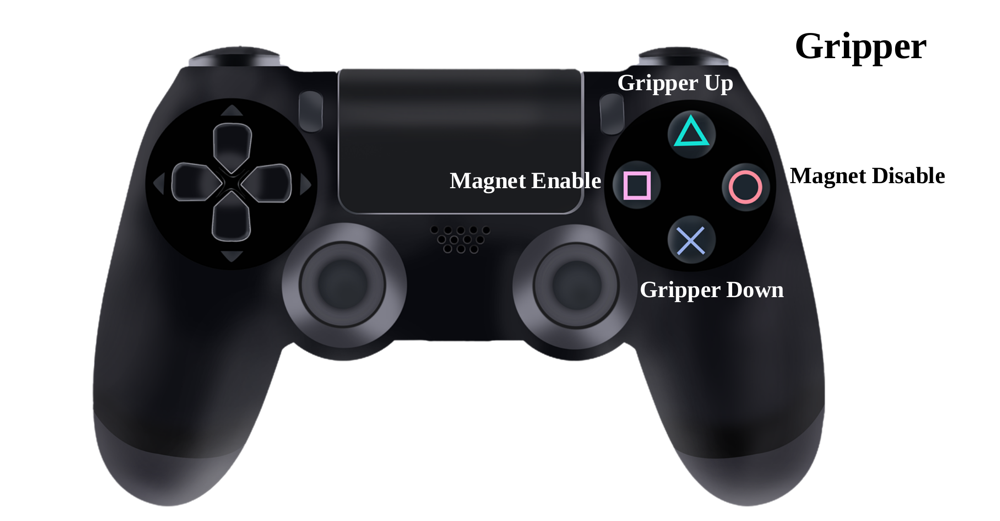

# Minesweepers_A 2024
**Minesweepers Competition'2024 Team A**

## Team Members:

### Team Leaders:
- Mariam Gadallah
- Ahmed Anwar

### Software Team Members:
- Noura Maklad
- Mohamed Mahdy

### Electrical Team Members:
- Youssef Hatem
- Mahmoud Sayed

### Mechanical Team Members:
- Mahmoud Essam
- Alaaeldin Manaa
- Omar Elgamal

## To-Do List:

- Make the robot move         (LEFT Stick or Buttons on the LEFT side)
  - [x] In Progress 
  - [x] Done
- Assign buttons for gripper  (RIGHT Stick or Buttons on the RIGHT side)
  - [x] In Progress 
  - [X] Done
- Mapping
  - IMU Calibration code
    - [x] In Progress 
    - [x] Done
  - IMU Madgwick (MPU 6050 Calibration node)
    - [x] In Progress 
    - [x] Done
  - Kalman Filter
    - [x] In Progress 
    - [ ] Done
- Mapping GUI 
  - [x] In Progress 
  - [ ] Done
- Streaming
  - [x] In Progress 
  - [x] Done
- Launch Files preparation 
  - [x] In Progress 
  - [ ] Done
- Assemble electrical components 
  - [X] In Progress 
  - [ ] Done
- Fabricate mechanical parts 
  - [x] In Progress 
  - [ ] Done
- Assemble mechanical parts 
  - [x] In Progress 
  - [ ] Done
- Test and integrate all components 
  - [x] In Progress 
  - [ ] Done
- Prepare Report and Video
  - [x] In Progress 
  - [ ] Done
- Prepare for the final presentation 
  - [ ] In Progress 
  - [ ] Done
--------------------------------------------------------------------
# Notes:
  - For Arduino ROS lib navigate to the following link:
    - [Arduino ROS](https://wiki.ros.org/rosserial_arduino/Tutorials/Arduino%20IDE%20Setup)
  - Must add ip for pc in pi host list (/etc/hosts)  in the following format : ip username ,and vice versa

## Controller Alignemnt

